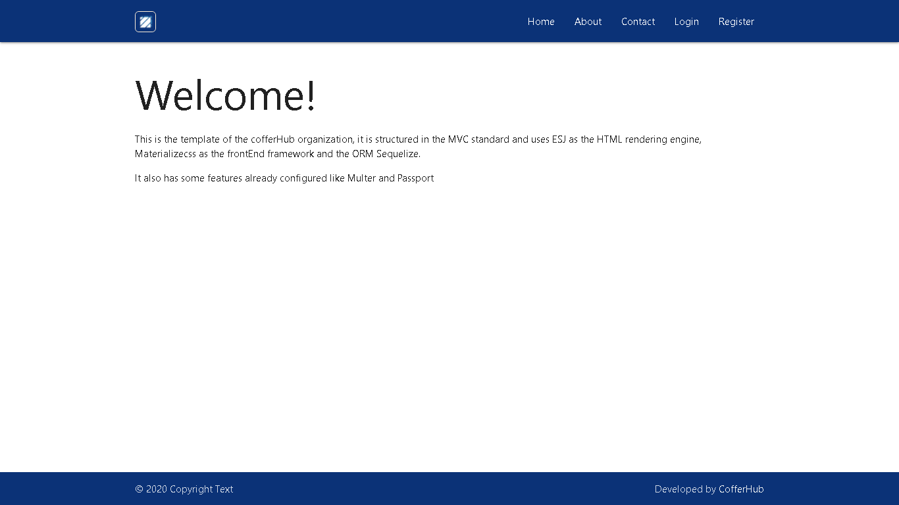
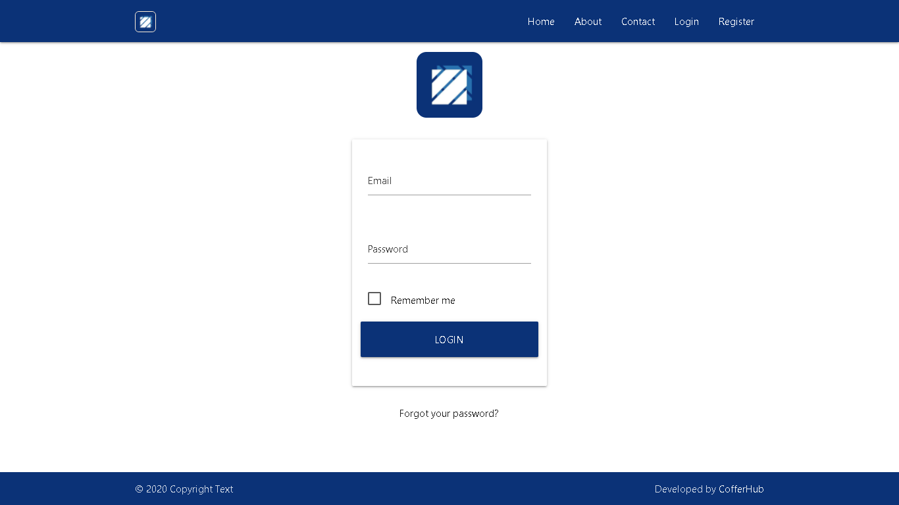
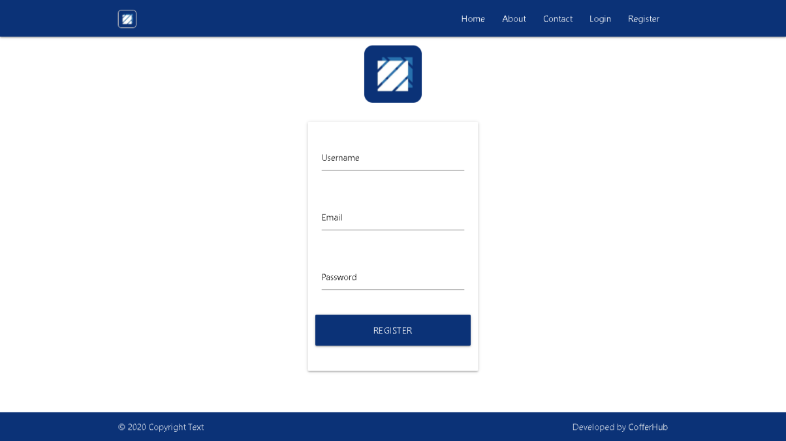
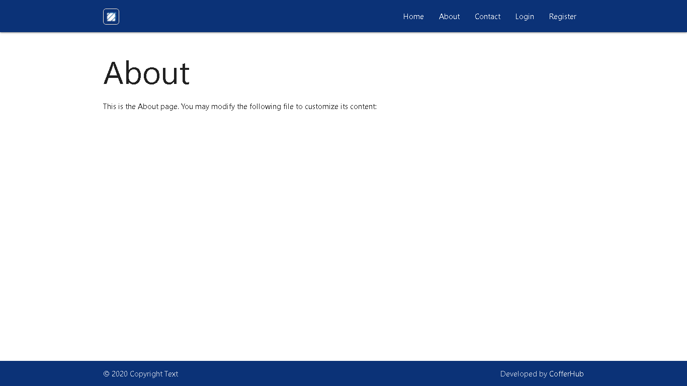

# Node.js MVC Template


<span>Photo by <a href="https://unsplash.com/@jefferyho?utm_source=unsplash&amp;utm_medium=referral&amp;utm_content=creditCopyText">Jeffery Ho</a> on <a href="https://unsplash.com/s/photos/architecture-green?utm_source=unsplash&amp;utm_medium=referral&amp;utm_content=creditCopyText">Unsplash</a></span>

> A boilerplate of NodeJS with MVC architecture using sequelizeORM.

## Table of contents
* [General info](#general-info)
* [Screenshots](#screenshots)
* [Technologies](#technologies)
* [Structure](#structure)
* [Setup](#setup)
* [Features](#features)
* [Contact](#contact)

## General info

The main purpose of the project was to create a NodeJS template with a MVC Design Pattern.

## Screenshots

<div style="display: flex; justify-content: space-between; align-self: center;">
  
  
  
  
  
</div>

## Technologies

* NodeJS - >= 13.0
* Express Framework - >= ^4.17.1
* ORM: Sequelize - >= ^6.6.2
* BD: MySql >= 8.0.21
* Template engine: EJS >= ^3.1.5
* Front-end framework: MaterializeCss - ^1.0.0-rc.2

## Setup

Describe how to install / setup your local environement / add link to demo version.

## Structure

```
├── bin
│   └── www
│
├── dist
│
├── public
│   ├── css
│   │   └── style.css
│   ├── img
│   │   └── favicon.ico
│   └── scrits
│       └── script.js
│
├── src
│   ├── config
│   │   ├── auth.js
│   │   └── passport.js
│   │
│   ├── controllers
│   │   └── UserController.js
│   │
│   ├── database
│   │   ├── config
│   │   │   └── database.js
│   │   ├── migrations
│   │   └── seeders
│   │
│   ├── models
│   │   ├── index.js
│   │   └── User.js
│   │
│   ├── routes
│   │   └── index.js
│   │
│   ├── views
│   │   ├── err
│   │   │   └── index.js
│   │   ├── layout
│   │   │   ├── _partials
│   │   │   │   ├── _footer.js
│   │   │   │   ├── _head.js
│   │   │   │   └── _header.js
│   │   │   └── index.js
│   │   └── page
│   │       ├── about.js
│   │       ├── auth.js
│   │       ├── contact.js
│   │       ├── index.js
│   │       ├── login.js
│   │       └── register.js
│   │
│   └── app.js
│
├── test
│   ├── sum.js
│   └──  sum.test.js
│
├── .editorConfig
├── .eslintrc.json
├── .sequelizerc
├── jest.config.json
├── LICENSE
├── package.json
└── README.md
```

## Code Examples
Show examples of usage:
`put-your-code-here`

## Features
List of features ready and TODOs for future development
* Awesome feature 1
* Awesome feature 2
* Awesome feature 3

To-do list:
* Wow improvement to be done 1
* Wow improvement to be done 2

## Contact
Created by [CofferHub](https://github.com/CofferHub) - feel free to contact us!
